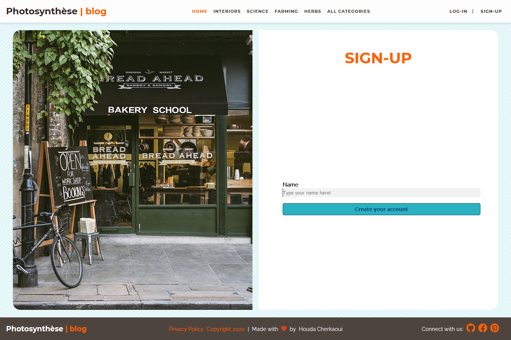

# Building Fotosynthesis Magazine with Rails

## About the project:

In this project, I built a comunity Blog magazine specialized in Plants, ecological farming, and home gardening.
This is the Capstone project for the end Ruby On Rails Module in [Microverse](https://www.microverse.org/) currriculum

This project project was built following the specifications , and user cases given by Microverse

[Read the projects specifications](https://www.notion.so/Lifestyle-articles-b82a5f10122b4cec924cd5d4a6cf7561)


## Table of content:

- [About the project](#about-the-project)
- [Presentation/Demo](#presentation)
- [Built with](#built-with)
- [Dependencies](#dependencies)
- [Getting started](#getting-started)
- [Deployment](#deployment)
- [Author](#author)
- [Contributing](#contributing)
- [Acknowledgments](#acknowledgments)
- [License](#License)


## Presentation/Demo:

- Video-presentation of the project
[Deom-video]()


- Main views screenshots:
<br>

<span> </span>
<br>
<span> </span>
<br>
<span> </span>


## Built with:

  <a href="https://www.ruby-lang.org/en/documentation/"></a>
  <a href="https://guides.rubyonrails.org/"></a>
  <a href="https://github.com/"></a>
  <a href="#"></a>
  <a href="#"></a>
  <a href="#"></a>
  <a href="#"></a>
  <a href="#"></a>
  <a href="#"></a>
  <a href="#"></a>
  <a href="https://developer.mozilla.org/en-US/docs/Web/JavaScript"></a>
  <a href="#"></a>


## Dependencies:

Additional Gems and dependencies used in this web application:

### In Development:
database:
- Postgresql

### In Tests:
database:
- Postgresql

Testing tool:
- Rspec

Helpers:
- Capybara
- Shoulda matchers
- Factories
- Faker
- Database_cleaner

### In Production:
database:
- Postgresql

## Linters:
- For Ruby: Rubocop
- For Scss/css : Styleling

## Data Models

<br>


<br><br>

## Getting started

To get a local copy of the repository please run the following commands on your terminal:

```
$ git clone git@github.com:CalyCherkaoui/lifestyle_capstone.git
$ cd lifestyle_capstone
$ git checkout development
$ bundle install --without production
$ yarn install --check-files
$ rails db:create
$ rails db:migrate
$ rails db:seed
```

Start server with:
```
$ sudo service postgresql restart
$ rails server
```
In your browser's adress field, type : http://localhost:3000

## Run tests
```
$ rpsec --format documentation
```

## Deployment:

This web-application was deployed with Heroku and AWS S3 (for Active storage)

Link to the webpage : 

## Author

👤 **Houda Cherkaoui**

- Github: [@CalyCherkaoui](https://github.com/CalyCherkaoui)
- Twitter: [@Houda59579688](https://twitter.com/Houda59579688)
- Linkedin: [Houda-Cherkaoui](https://www.linkedin.com/in/houda-cherkaoui-64106395/)


## 🤝 Contributing

Contributions, issues and feature requests are welcome!

## Show your support

Give a ⭐️ if you like this project!

## Acknowledgments

- Design based on the work of [Nelson Sakwa](https://www.behance.net/sakwadesignstudio) published in [Behance.net](https://www.behance.net/gallery/14554909/liFEsTlye-Mobile-version)
- Hat tip to [stackoverflow](https://stackoverflow.com) comunity.
- Hat tip to [Microverse](https://www.microverse.org/) TSE for Code Review
- Hat tip to anyone whose code was used

## 📝 License

All source codeis available jointly under the MIT License.
See [MIT licence]() for details.
